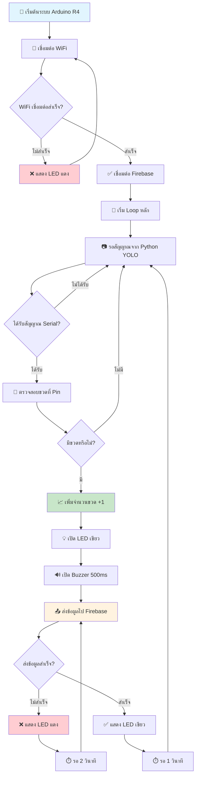
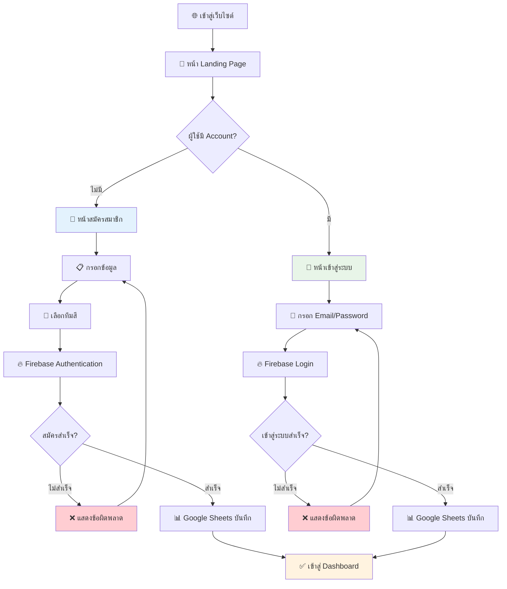
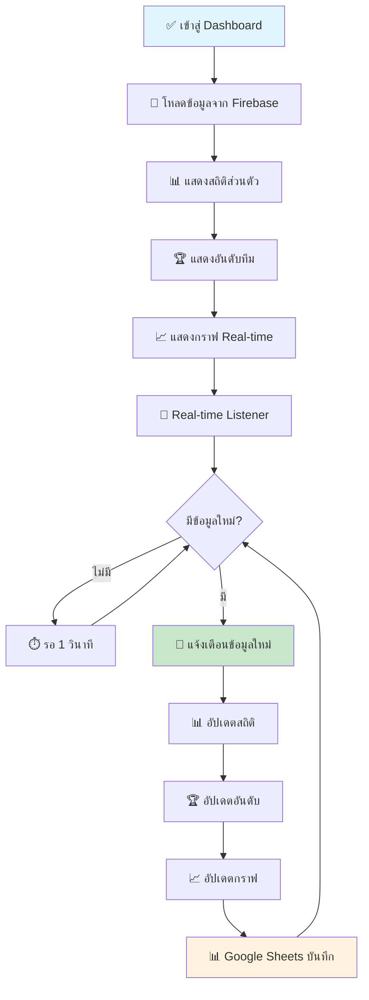
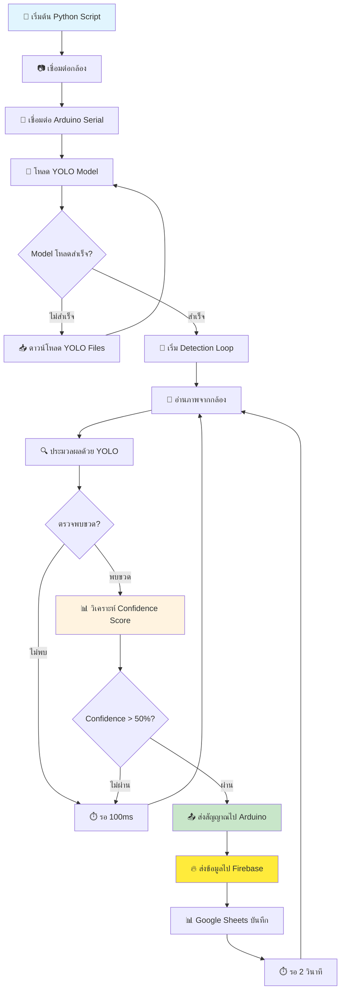
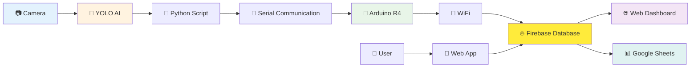
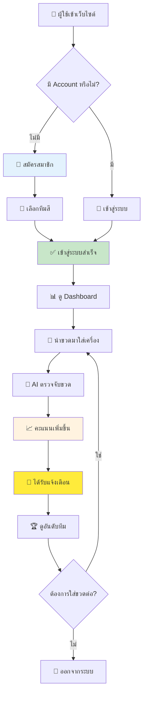
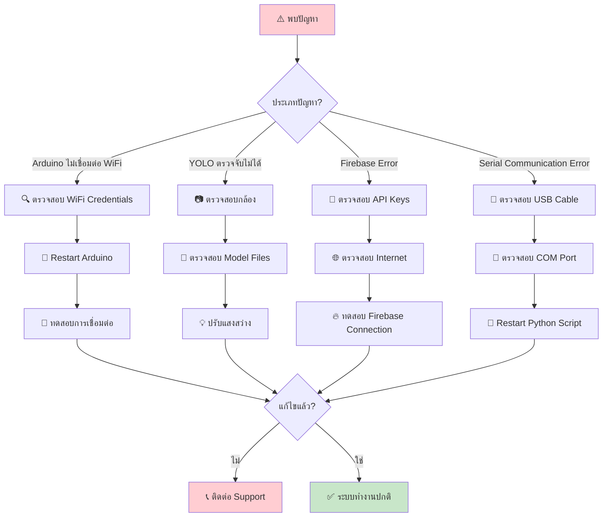

# 📊 Flowchart การทำงานของระบบ P2P (Plastic to Points)

## 🔧 1. การทำงานของตัวเครื่อง (Hardware System)



---

## 📱 2. การทำงานของตัวแอป (Web Application)

### 🔐 ระบบ Authentication



### 📊 ระบบ Dashboard



---

## 🤖 3. การทำงานของ AI Detection System



---

## 🔄 4. Data Flow ทั้งระบบ



---

## 📋 5. ขั้นตอนการใช้งานสำหรับผู้ใช้



---

## 🔧 6. ขั้นตอนการแก้ไขปัญหา (Troubleshooting)



---

## 📊 7. Google Sheets Data Flow

```mermaid
flowchart TD
    A[🔥 Firebase Event] --> B{ประเภท Event?}
    
    B -->|User Registration| C[📝 sendUserRegistrationToSheets()]
    B -->|User Login| D[🔑 sendUserLoginToSheets()]
    B -->|Bottle Collection| E[🍼 sendBottleDataToSheets()]
    
    C --> F[📊 Google Apps Script]
    D --> F
    E --> F
    
    F --> G[📋 ตรวจสอบ Sheet ที่ต้องการ]
    G --> H{Sheet มีอยู่หรือไม่?}
    
    H -->|ไม่มี| I[📄 สร้าง Sheet ใหม่]
    I --> J[📝 เพิ่ม Headers]
    J --> K[💾 บันทึกข้อมูล]
    
    H -->|มี| K
    K --> L[✅ ส่งผลลัพธ์กลับ]
    L --> M[🔔 แจ้งเตือนสำเร็จ]
    
    style F fill:#fff3e0
    style K fill:#c8e6c9
    style M fill:#e8f5e8
```

---

**🎯 หมายเหตุ:** Flowchart เหล่านี้แสดงการทำงานของระบบ P2P (Plastic to Points) อย่างละเอียด ตั้งแต่การตรวจจับขวดด้วย AI จนถึงการแสดงผลบน Dashboard และการบันทึกข้อมูลใน Google Sheets

**🔄 การอัปเดต Real-time:** ระบบทำงานแบบ Real-time ทำให้ผู้ใช้เห็นผลลัพธ์ทันทีที่มีการเก็บขวด และสามารถแข่งขันกันระหว่างทีมได้อย่างสนุกสนาน! 🏆